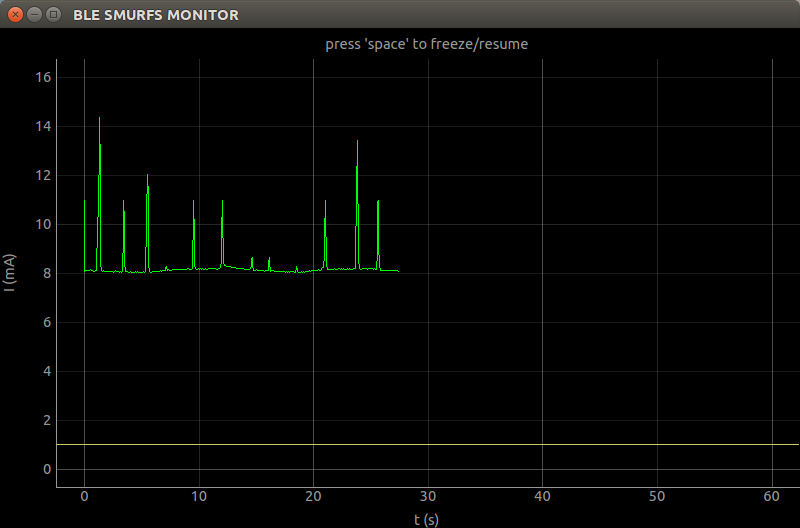

BLE SMURFS
==========

BLE SMURFS is mbed enabled development board with Bluetooth Low Energy. It's optimized for low power and wearable application.
The BLE SMURFS MONITOR will help lower the power consumption of your application with the BLE SMURFS.

----

This software in this repository is written by [Seeedstudio](http://seeed.cc) 
and is licensed under [The Apache License V2.0](http://www.apache.org/licenses/LICENSE-2.0). 

Contributing to this software is warmly welcomed. You can do this basically by 
[forking](https://help.github.com/articles/fork-a-repo), committing modifications and then [pulling requests](https://help.github.com/articles/using-pull-requests) (follow the links above 
for operating guide). Adding change log and your contact into file header is encouraged. 
Thanks for your contribution.

Seeed Studio is an open hardware facilitation company based in Shenzhen, China.  
Benefiting from local manufacture power and convenient global logistic system,  
we integrate resources to serve new era of innovation. Seeed also works with  
global distributors and partners to push open hardware movement. 

