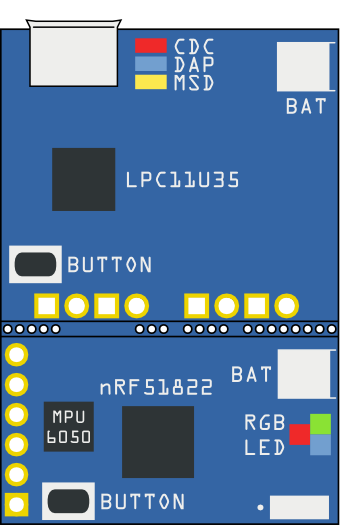
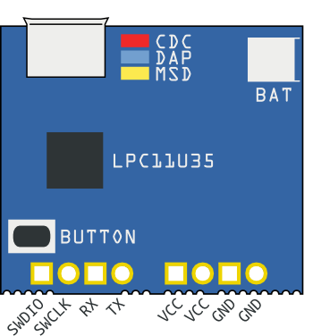
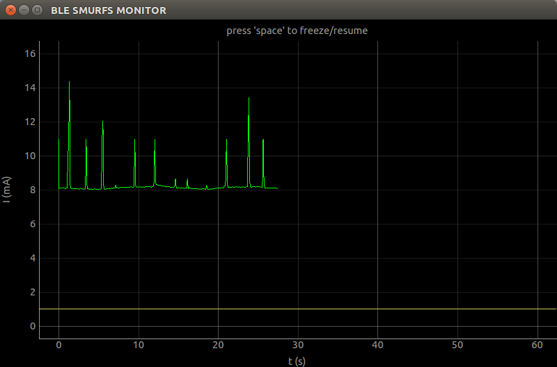
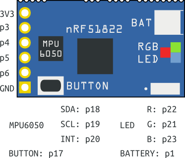
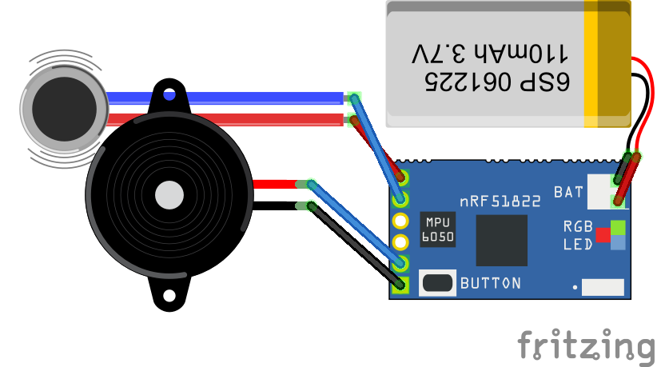

Tiny BLE
==========

The Tiny BLE is a Bluetooth Low Energy development board designed with low energy consumption and small size in mind. It's integrated with current measurement feature to provide real time energy consumption data, which is essential for developers to optimize software to design long battery life devices. It supports ARM mbed cloud-based IDE with an handy C/C++ SDK and a large number of open source libraries, which makes prototyping and development extremely easy. Further, to keep it small, we use modular design to enable it divide into two parts - CMSIS DAP interface part and BLE part.

----
### CMSIS DAP Interface Part
The interface is very powerful to provide features :

+ Drag-n-drop programming
+ CMSIS DAP debug
+ USB Virtual serial port
+ Current measurement
+ Battery charging

To enable the current measurement feature, just set the baud rate of the USB virtual serial port to 4000000+, then the current data of the BLE part will be sent through the virtual serial port. To make data easier to use, we create a cross platform tool - BLE Smurfs Monitor to make it visual.

+ [Tiny BLE Monitor for Windows](http://tangram.qiniudn.com/ble_smurfs_monitor_v0.1.exe)
+ [Tiny BLE Monitor for Linux/Mac OS](https://github.com/Seeed-Studio/Tiny_BLE/tree/master/utils), additional requirements: pyqtgraph, pyside

----

### BLE part

+ Nordic nRF51822 with BLE and ARM Cortex M0
+ MPU6050, 3d accelerometer and 3d gyroscope
+ RGB LED
+ Battery Connector & Battery Voltage Measurement
+ all 4 I/Os can be used as analog input, digital input/output, i2c, spi or uart

The BLE part is built on the Nordic nRF51822 with Bluetooth Low Energy 2.4GHz multiprotocol radio and a 32 bit ARM Cortex-M0 core running 16MHz.
MPU6050, a 6 DOF with 3D accelerometer and 3D gyroscope, is integrated to provide motion detect feature. The Digital Motion Processor (DMP) of the MPU6050 provide several features (such as gesture detect, pedometer, calibrating gyro data) which
can reduce running time of the nRF51822 to get a long battery life. It also integrates battery connector and battery voltage measurement circuit for you.
We custom a bootloader for the BLE Smurfs to enable Firmware-Over-The-Air feature. when the BLE Smurfs is divided into two parts, we can still update the firmware of the nRF51822 through FOTA

Have fun!

----

This software in this repository is written by [Seeedstudio](http://seeed.cc) 
and is licensed under [The Apache License V2.0](http://www.apache.org/licenses/LICENSE-2.0).

Contributing to this software is warmly welcomed. You can do this basically by 
[forking](https://help.github.com/articles/fork-a-repo), committing modifications and then [pulling requests](https://help.github.com/articles/using-pull-requests) (follow the links above 
for operating guide). Adding change log and your contact into file header is encouraged. 
Thanks for your contribution.

Seeed Studio is an open hardware facilitation company based in Shenzhen, China.  
Benefiting from local manufacture power and convenient global logistic system,  
we integrate resources to serve new era of innovation. Seeed also works with  
global distributors and partners to push open hardware movement. 

